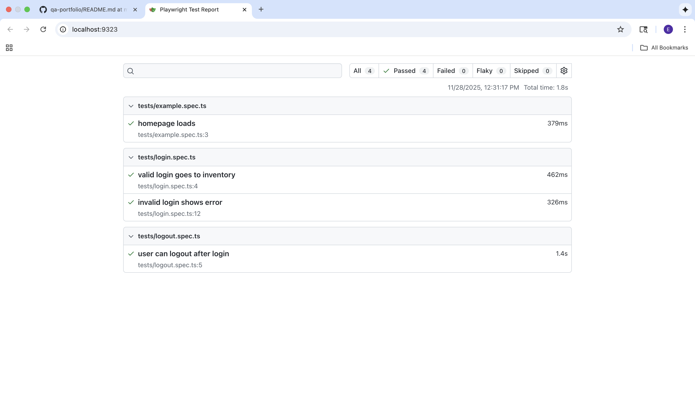

Secure Case Portal – Playwright Test Automation

This project demonstrates end to end testing using Playwright + TypeScript, built as a mock government style Secure Case Portal login and logout flow (using saucedemo.com).

🧪 Tech Stack

Playwright Test Runner

TypeScript

Page Object Model (POM)

Visual Studio Code

Git and GitHub version control

✅ Test Coverage
Login

Valid login → navigates to inventory

Invalid login → shows error message

Logout

User logs out and returns to login page

▶️ Run Tests Locally
npm install
npx playwright install
npx playwright test --headed

## 📊 Playwright HTML Report

👤 Author

Randy Mitchell
QA Engineer
LinkedIn: https://www.linkedin.com/in/randy-mitchell-74467217b